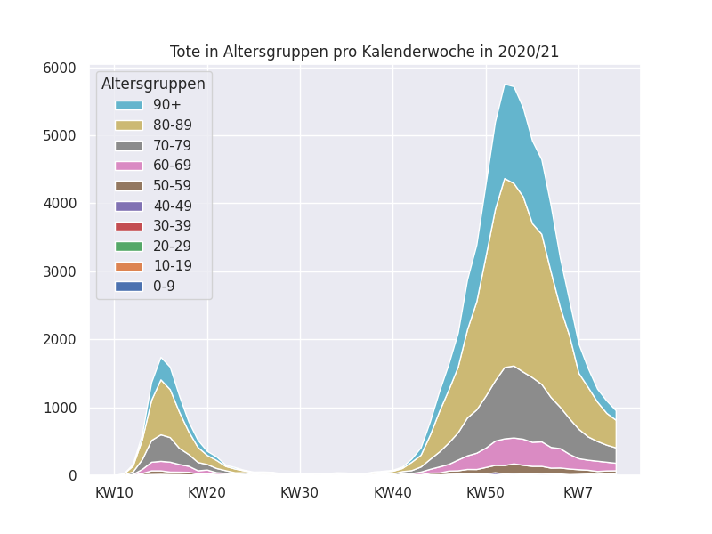
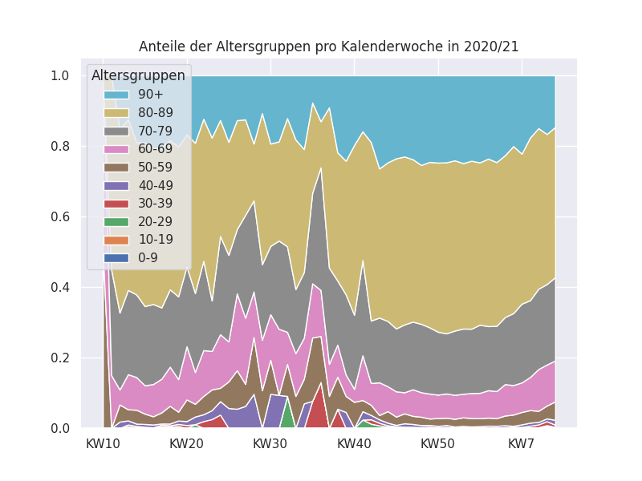

Plotting the age distributions of the weekly deaths in Germany
---

1. Download the data as `COVID-19_Todesfaelle.xlsx` from 
https://www.rki.de/DE/Content/InfAZ/N/Neuartiges_Coronavirus/Projekte_RKI/COVID-19_Todesfaelle.html

2. Run `python3 plotthenums.py`

3. Check the plots

# License

The code is under the MIT license -- see the license file. The license does **not** extend to the data `COVID-19_Todesfaelle.xlsx` that belongs to `www.rki.de` and that I have included for testing.
